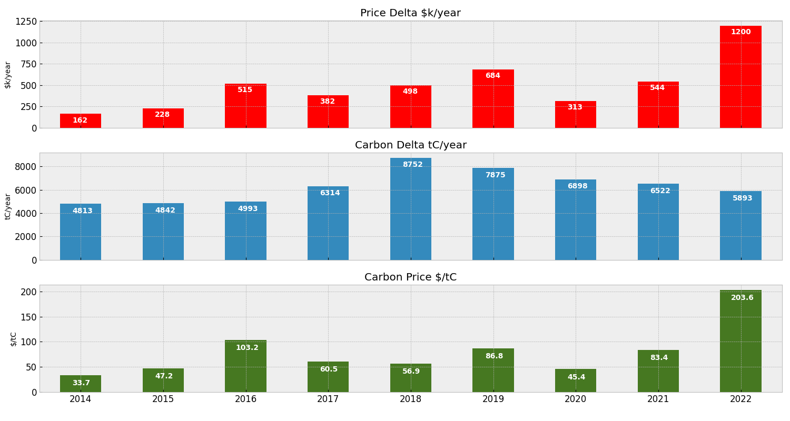

# Space Between Money and the Planet

Supporting materials for the blog post [Space Between Money and the Planet](https://adgefficiency.com/space-between-money-and-the-planet/).



<p align="center"><em>Annual price, carbon and carbon price deltas for 2014 to 2022</em>.</p>

You can use the notebook in `./notebooks/results-viewer.ipynb` to view the experiment results.

## Reproduce Experiment

```shell
$ make results
```

## Download Experiment Results

If you don't want to run the experiment from scratch, you can pull the results from S3 using - requires Python:

```shell
$ make pulls3
```
